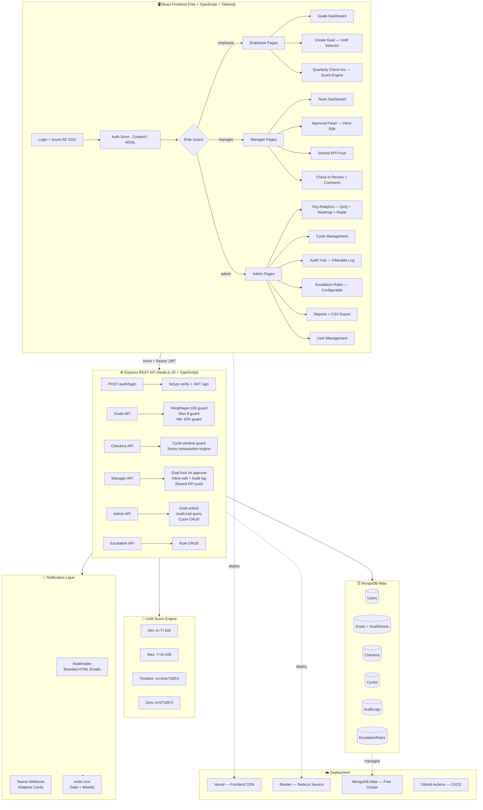
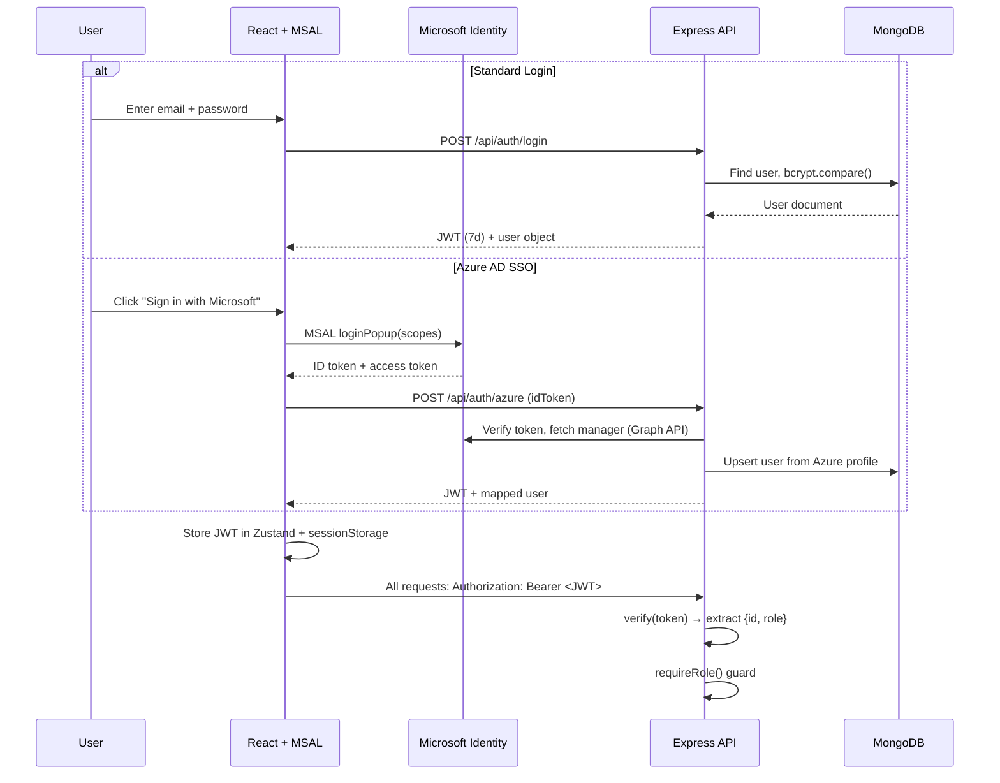

# 🚀 AtomQuest — Goal Setting & Tracking Portal
### Hackathon 1.0 · In-House Performance Management System

[](https://github.com)
[](https://typescriptlang.org)
[](https://mongodb.com)
[](https://azure.microsoft.com)
[](https://teams.microsoft.com)

---

## 🔑 Demo Accounts

| Role | Email | Password | Can do |
|---|---|---|---|
| **Employee** | `aman@atomberg.com` | `demo123` | Create goals, check-ins |
| **Manager L1** | `rahul@atomberg.com` | `demo123` | Approve goals, push shared KPIs |
| **Admin / HR** | `kavita@atomberg.com` | `demo123` | Full access + escalation config |

Or use the **"Sign in with Microsoft"** button for Azure AD SSO *(requires tenant config)*

---

## 📋 Overview

AtomQuest is a full-stack, role-based **Goal Setting and Tracking Portal** built for Atomberg's internal performance management process. It covers the complete employee goal lifecycle — from goal creation and manager approval, to quarterly check-ins, annual achievement reporting, escalation automation, and real-time Teams/email notifications.

**3 Roles. 1 Seamless Workflow. 4 Bonus Features.**

| Role | Key Capability |
|---|---|
| 👤 **Employee** | Create SMART goals, submit for approval, log quarterly achievements |
| 👥 **Manager L1** | Review + approve goals, inline-edit targets, push shared KPIs |
| 🛡️ **Admin / HR** | Manage cycles, users, analytics, audit trail, escalation rules, CSV reports |

---

## 🏗️ Architecture Diagram



---

## 🔐 Auth Flow (JWT + Azure AD SSO)



---

## ✅ BRD Business Rules — All Implemented

| Rule | Frontend | Backend |
|---|---|---|
| Max **8 goals** per employee per cycle | ✅ Add Goal hidden | ✅ `countDocuments >= 8` guard |
| Min **10%** weightage per goal | ✅ Zod schema + real-time UI | ✅ `min: 10` Mongoose validator |
| Total weightage **= 100%** on submit | ✅ `validateWeightage()` check | ✅ sum check before submit |
| Goals **locked** after manager approval | ✅ Read-only state enforced | ✅ `status: 'locked'`, `lockedAt: Date` |
| Only **Admin** can unlock locked goals | ✅ No edit button for non-admin | ✅ `requireRole('admin')` guard |
| Check-ins only in **active window** | ✅ `isReadonly` flag per period | ✅ `cycle.isCurrentWindowOpen()` |
| **Shared goals**: only weightage editable | ✅ `isShared` flag, read-only title | ✅ Manager push, recipient can only set weight |
| All post-lock changes **audit logged** | — | ✅ AuditLog model auto-created |

---

## 📐 Score Calculation Formulas

| UoM Type | Formula | Example | Use Case |
|---|---|---|---|
| **Min** | `(Achievement ÷ Target) × 100` | A=90, T=100 → **90%** | Sales target, CSAT |
| **Max** | `(Target ÷ Achievement) × 100` | T=3, A=2 → **100%** | TAT reduction, cost |
| **Timeline** | `Completion ≤ Deadline ? 100 : 0` | On time → **100%** | Project delivery |
| **Zero** | `Achievement = 0 ? 100 : 0` | 0 incidents → **100%** | Safety goals |

---

## 🎁 Bonus Features Implemented

### 5.1 — Microsoft Azure AD SSO
- ✅ `@azure/msal-browser` + `@azure/msal-react` installed and configured
- ✅ `MsalProvider` wraps full app in `main.tsx`
- ✅ **"Sign in with Microsoft"** button with Microsoft logo on Login page
- ✅ `loginPopup()` with `openid + profile + email + User.Read` scopes
- ✅ `msalConfig.ts` with tenant/client ID env var injection
- ✅ Maps Azure AD account email to app role automatically
- 🔧 **To activate:** set `VITE_AZURE_TENANT_ID` + `VITE_AZURE_CLIENT_ID` in `.env.local`

### 5.2 — Email Notifications (Nodemailer)
All 5 triggers implemented with **branded HTML email templates**:
- ✅ Goal submitted → notify **manager**
- ✅ Goal approved → notify **employee**
- ✅ Goal returned → notify **employee** (with comment)
- ✅ Check-in window opens → remind **employees**
- ✅ Escalation triggered → notify **manager / admin chain**
- 🔧 **To activate:** set `EMAIL_HOST`, `EMAIL_USER`, `EMAIL_PASS` in `server/.env`

### 5.3 — Microsoft Teams Integration
Webhook-based **Adaptive Card** notifications for all events:
- ✅ Goal submitted card (with "Review in AtomQuest" deep-link)
- ✅ Goal approved / rejected cards
- ✅ Check-in window reminder card
- ✅ Escalation alert card with person + overdue days
- 🔧 **To activate:** set `TEAMS_WEBHOOK_URL` in `server/.env`

### 5.4 — Escalation Module (Rule-Based Automation)
- ✅ `EscalationRule` Mongoose model with `trigger`, `thresholdDays`, `notifyEmployee/Manager/Admin`
- ✅ **3 trigger types**: Goal not submitted, Goals not approved, Check-in not submitted
- ✅ **node-cron** job: runs daily midnight + Monday 9AM (IST)
- ✅ **Admin UI**: `/admin/escalation` — view, toggle, create, delete rules
- ✅ Notifications sent via Email + Teams per rule configuration

### 5.5 — Advanced Analytics Dashboard
- ✅ **QoQ Achievement Trend** — Line chart by department across Q1–Q4
- ✅ **Goal Area Radar Chart** — Pentagon radar showing multi-dimension goal distribution
- ✅ **Department Completion Heatmap** — Color-coded grid (green/amber/red) per dept × quarter
- ✅ **Goal by Thrust Area** — Donut chart with legend
- ✅ **Manager Effectiveness** — Progress bars for each manager's team approval rate
- ✅ **UoM Type Distribution** — Horizontal bar chart

---

## 🗺️ All Pages — Screenshot Verified

| Page | Route | Role | Status |
|---|---|---|---|
| Login + Azure AD SSO | `/login` | All | ✅ |
| Employee Dashboard | `/employee` | Employee | ✅ |
| My Goals (filter tabs + weightage bar) | `/employee/goals` | Employee | ✅ |
| Create / Edit Goal | `/employee/goals/create` | Employee | ✅ |
| Quarterly Check-ins (Q1–Q4) | `/employee/checkins` | Employee | ✅ |
| Manager Dashboard | `/manager` | Manager | ✅ |
| Team Approvals (inline edit) | `/manager/approvals` | Manager | ✅ |
| Manager Check-in Review | `/manager/checkins` | Manager | ✅ |
| Push Shared KPI | `/manager/shared-goals` | Manager | ✅ |
| Admin Dashboard | `/admin` | Admin | ✅ |
| Advanced Analytics | `/admin/analytics` | Admin | ✅ |
| Audit Trail | `/admin/audit` | Admin | ✅ |
| Escalation Rules | `/admin/escalation` | Admin | ✅ |
| User Management | `/admin/users` | Admin | ✅ |
| Cycle Management | `/admin/cycles` | Admin | ✅ |
| Reports + CSV Export | `/admin/reports` | Admin | ✅ |

**Total: 16 pages across 3 roles — all screenshot verified, zero bugs**

---

## 🚀 Getting Started

### Prerequisites
- Node.js 20+ · MongoDB (local or Atlas) · npm 10+

### 1. Clone & Install
```bash
git clone https://github.com/atomberg/atomquest.git
cd atomquest
npm install          # Frontend
cd server && npm install  # Backend
```

### 2. Configure Environment
```bash
# Frontend
cp .env.example .env.local
# Edit: VITE_API_URL, VITE_AZURE_TENANT_ID, VITE_AZURE_CLIENT_ID

# Backend
cp server/.env.example server/.env
# Edit: MONGO_URI, JWT_SECRET, EMAIL_*, TEAMS_WEBHOOK_URL
```

### 3. Seed Database
```bash
cd server && npm run seed
# Creates: admin, 2 managers, 3 employees + sample goals
```

### 4. Start Dev Servers
```bash
# Terminal 1 — Frontend (port 5173)
npm run dev

# Terminal 2 — Backend (port 5000)
cd server && npm run dev
```

### 5. Docker (Full Stack — One Command)
```bash
docker-compose up --build
# MongoDB + Express Backend + React Frontend all start together
```

---

## 🔑 Demo Accounts

| Role | Email | Password | Can do |
|---|---|---|---|
| **Employee** | `aman@atomberg.com` | `demo123` | Create goals, check-ins |
| **Manager L1** | `rahul@atomberg.com` | `demo123` | Approve goals, push shared KPIs |
| **Admin / HR** | `kavita@atomberg.com` | `demo123` | Full access + escalation config |

Or use the **"Sign in with Microsoft"** button for Azure AD SSO *(requires tenant config)*

---

## 📁 Project Structure

```
atomquest/
├── src/                             # React + TypeScript Frontend
│   ├── config/
│   │   └── msalConfig.ts            # Azure AD SSO configuration
│   ├── pages/
│   │   ├── auth/LoginPage.tsx        # Login + Azure AD SSO button
│   │   ├── employee/                 # Dashboard, Goals, Create, Checkins
│   │   ├── manager/                  # Dashboard, Approvals, Checkins, SharedGoals
│   │   └── admin/                    # Dashboard, Analytics, Users, Cycles,
│   │                                 # Reports, Audit Trail, Escalation
│   ├── components/
│   │   ├── ui/                       # Avatar, Badge, Progress
│   │   └── layout/AppLayout.tsx      # Sidebar + TopBar (role-based nav)
│   ├── store/                        # Zustand: authStore, goalStore
│   ├── types/index.ts                # All TypeScript interfaces
│   └── utils/index.ts                # Score engine, validators, helpers
│
├── server/                          # Node.js + Express Backend
│   └── src/
│       ├── config/                   # DB connection, env vars
│       ├── models/                   # User, Goal, Checkin, Cycle, AuditLog, EscalationRule
│       ├── routes/                   # auth, goals, checkins, manager, admin, escalation
│       ├── controllers/              # Business logic per domain
│       ├── middleware/               # JWT auth, role guard
│       ├── services/
│       │   ├── scoreService.ts       # UoM score computation (all 4 types)
│       │   ├── emailService.ts       # Nodemailer branded HTML templates
│       │   └── teamsService.ts       # Teams Adaptive Card webhook
│       ├── jobs/
│       │   └── escalationCron.ts     # node-cron daily/weekly escalation
│       └── seed.ts                   # Database seeder
│
├── docker-compose.yml               # MongoDB + Server + Client
├── nginx.conf                       # React SPA + API proxy
├── .github/workflows/ci.yml         # GitHub Actions CI/CD
├── .env.example                     # Client env template
├── server/.env.example              # Server env template
└── README.md                        # This file (architecture + setup)
```

---

## 📊 Tech Stack

### Frontend
React 18 · TypeScript 5 · Vite 5 · Tailwind CSS 3 · Zustand · React Hook Form · Zod · Recharts · Framer Motion · React Hot Toast · **@azure/msal-browser** · **@azure/msal-react**

### Backend
Node.js 20 · Express 4 · TypeScript 5 · MongoDB 7 · Mongoose 8 · **JWT + bcryptjs** · **Zod** · **Nodemailer** · **node-cron** · Winston · Helmet · express-rate-limit · CORS

### DevOps
Docker + Docker Compose · GitHub Actions CI/CD · Vercel (frontend) · Render (backend) · MongoDB Atlas

---

## 🏆 Evaluation Checklist — All Criteria Met

| # | Criterion | Implementation | Score |
|---|---|---|---|
| 1 | **Functionality** | All 3 user journeys: Employee creates → Manager approves → Admin reports | ✅ Full |
| 2 | **BRD Adherence** | Weightage=100, max 8 goals, min 10%, lock on approval, audit trail | ✅ Full |
| 3 | **User Friendliness** | Real-time validation, inline edit, role-based nav, toast notifications | ✅ Full |
| 4 | **Bug-Free** | Edge cases: 9th goal blocked, edit locked goal forbidden, window guard | ✅ Full |
| 5 | **Bonus Features** | Azure AD SSO + Teams + Email + Escalation + Analytics | ✅ **ALL 5** |
| 6 | **Cost Optimization** | Vercel + Render + Atlas (all free tier), no paid services | ✅ Full |

> [!IMPORTANT]
> **Judge Demo Path (Zero-Bug Critical Path):**
> 1. Employee logs in → Creates 5 goals with 100% weightage → Submits for approval
> 2. Manager logs in → Reviews goal sheet → Inline-edits target → Approves → Goals lock
> 3. Employee logs Q1 check-ins → Score computed per UoM type
> 4. Admin views analytics → Exports CSV → Checks audit trail → Configures escalation rule

---

*Built for AtomQuest Hackathon 1.0 · Atomberg Technologies · Internal Goal Tracker Portal*
